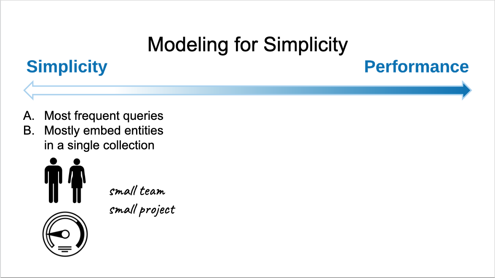
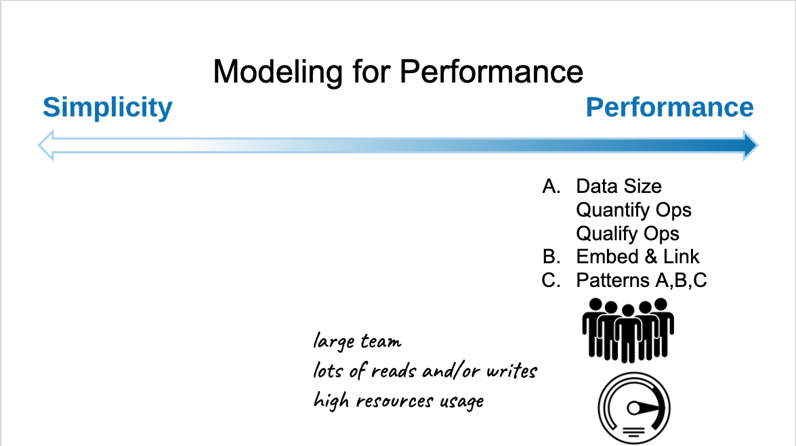
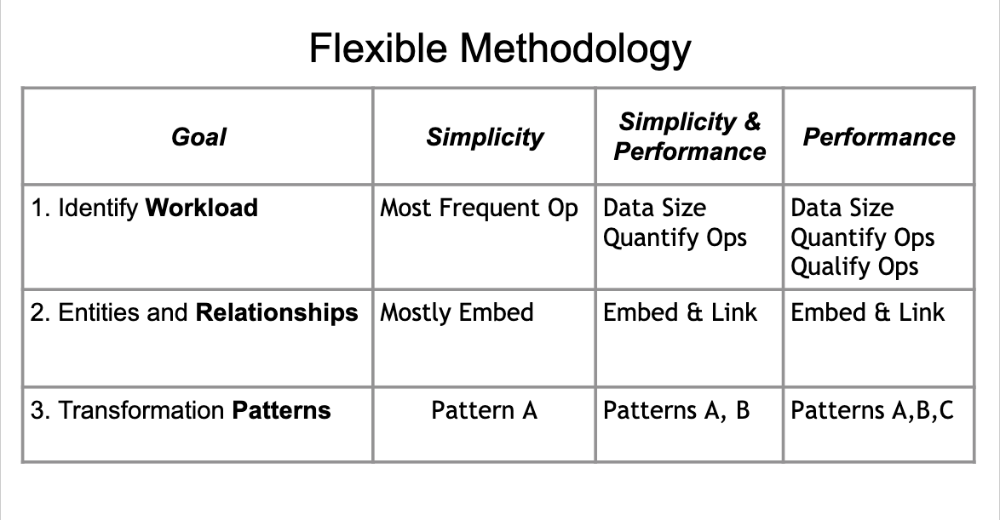
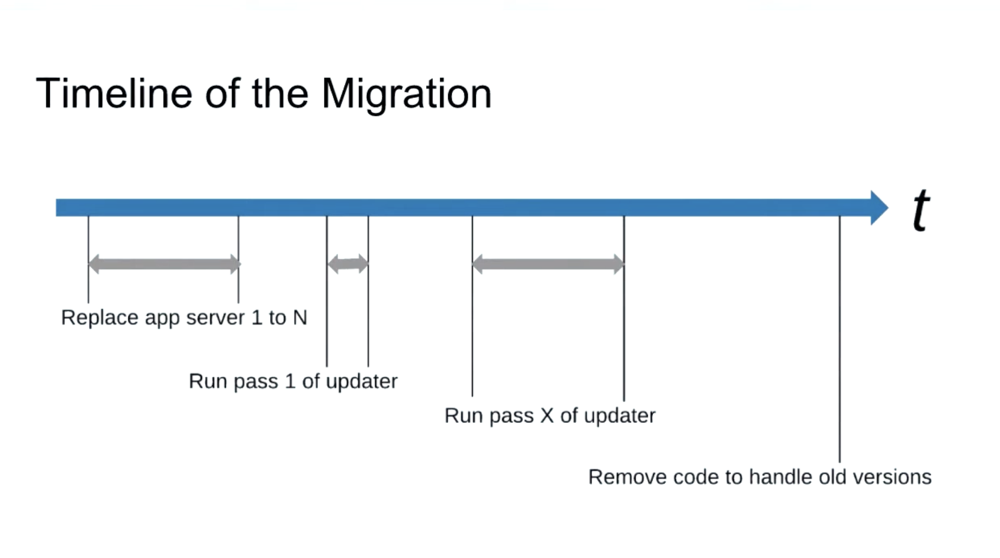
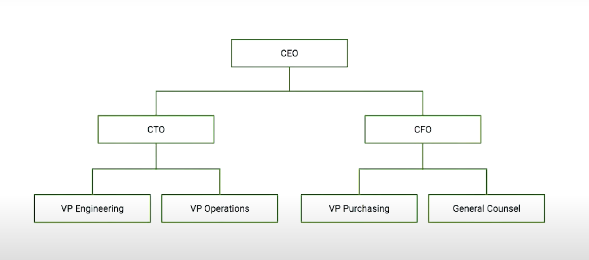
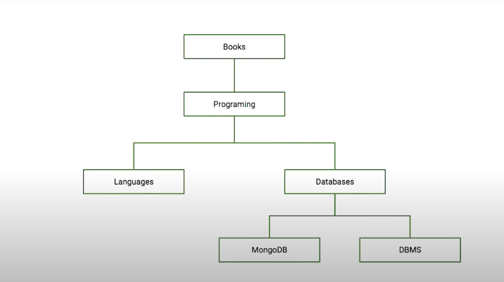
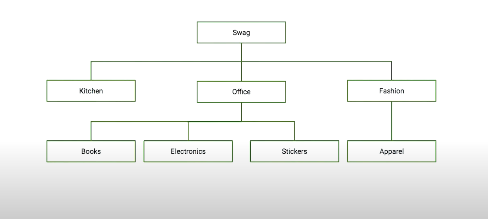
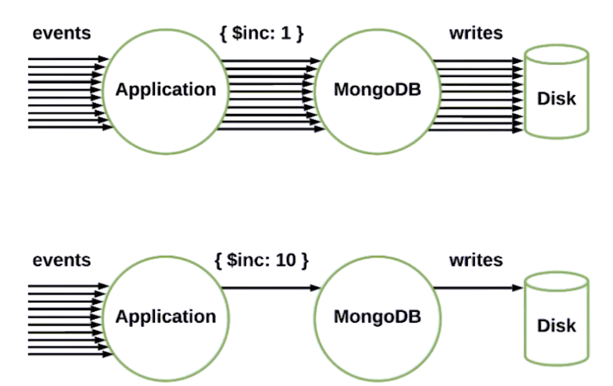
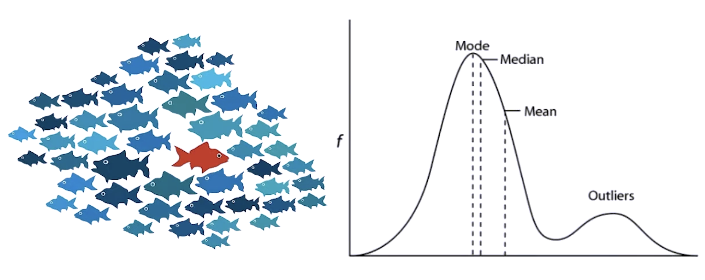
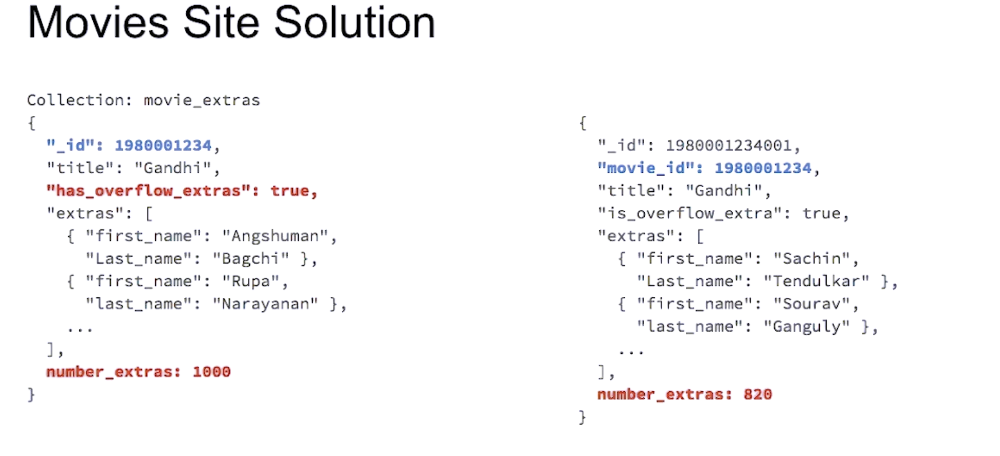

# M320: Data Modeling

Learn everything you need to know about data modeling for MongoDB.

## Chapter 1: Introduction to Data Modeling

---

### Data Modeling in MongoDB

- One of the most misconception about mongodb is that modeling is Schemaless means that it doesn't really matter which field documents have or how different the documents can be from one another, or how many collection you might have per database.
- Even that mongodb give you this flexibility, this is not practical in reality.
- MongoDB has very flexible data model.
- But most importantly all data as some sort of structure and there for a Schema.
- MongoDB just happens to make it easier for you to deal with that later rather than sooner.
- Before building ERD or UML it tends to be preferable to start building your application and finding out from that particular experience what the data structure should look like.
- However if you do know: - Usage pattern. - How your data is accessed. - Which queries are critical to your application, - Ratios between reads and writes
  you will be able to extract a good model, even before rewriting the full application to make it scale with mongodb.
- Being flexible means that your application changes. and it's not unreasonable to think that that will not be the case.
- With mongo you will be able to accomodate those changes without experiencing a painful migration process like in traditional relational databases.
- When have a good idea about the structure of your documents you will be able to enforce those rules in MongoDB by using **Document Validation**
- Another misconception is that all information regardless of how data should be manipilated can be stored in one single document, but the reality is that this is not the way applications in general use data.
- Keep the amount of the iformation stored per individual document to the data that your application uses and having different models to deal with historical data or other types of data that are not always accessed
- We can berform data joining process using $lookup

### The Document Model in MongoDB

- Database -> Collection -> Document
- Document stored in BSON
- Instead of but your related data in multible table you can put the related data nestead in the same document and put it all down in a single query
- You can have multiple version of your document schema and they can be coexists in the same collection

> You can read more about [Document Structure](https://www.mongodb.com/docs/manual/core/data-modeling-introduction/#document-structure) and [BSON Data Types](https://www.mongodb.com/docs/upcoming/reference/bson-types/)

### Constraints in Data Modeling

1. Hardware:
   - RAM
   - SSD, HDD
2. Data:
   - Size
   - Security, sovereignty
3. Application:
   - Network latency
4. DB Server:
   - MongoDB has limitaion on doc size 16MB

- **Working Set**: Is the data that the Application uses in normal operations

- **Tips**:
  - Keep the frequently used documents in RAM
  - Keep the indexes in RAM
  - Prefer SSD to HDD
  - Infrequently accessed data in hdd

> To know more about Transactions with MongoDB, please consult the MongoDB [Documentation on Transactions](https://www.mongodb.com/docs/manual/core/transactions/) and some [videos explaining their implementation](https://www.mongodb.com/transactions) .

### The Data Modeling Methodology


**Phases**:

1. Describing workloads:

   - Requirement document
   - Business domain analysis
   - Production logs and stats if migrating existing db

2. Indentifying relationships between entities:

   - pieces of info that can be grouped together (entity)
   - Indentifying the relationships between entities
   - decide either keeping as embedded doc or in a new collection

3. Applying design patterns to address performance requirements

### Model for Simplicity or Performance

The main tradoff you will face is Simplicity vs Performance or try to find the balance between them

- **Modeling for Simplicity**: - limitied expectations - low resources requiremens cpu ram disk - fewer collections and embedding documents - less disk access
  

- **Modeling for Performance**: - need more resources - Sharding - fast read, writes - larger teams needed - must adhere to the phases of methodology
  

- **Modeling for a Mix of Simplicity and Performance**
  

- **Summary of Modeling Approaches**:
  

## Chapter 2: Relationships

---

### Introduction to Relationships

- Even MongoDB is classified as non-relationa database but the pieces of data inside will have relations.
- Mainly these relations is done by embeding or referencing.
- The relationships represent all the entities are related to each other.
- For example:
  - customer and customer_id is One-to-One relationship
  - Customer and invoices is One-to-Many relationship
  - Invoices and Products is Many-to-Many relationship

### Relationship Types and Cardinality

- **Cardinalities**:

  - one-to-one (1-1) grouped in the same doc
  - one-to-many (1-N)
  - many-to-many (N-N)

- one-to-many or many-to-many:
  - it depends on how much likely the many will be
  - in father - children situation, it's likely to be max of 5 or 10
  - in follower - following situation, it may be 10 or 10,000
- one-to-zilions is useful in the Big Data world
- Numerical Notation: [min, likely, max]
  - minimum
  - most likely
  - maximum

### One-to-Many Relationship

- For exmaple: Person and credit cards

- **Solutions**:

  1.  Embedded doc:

      - all in one collection
      - usually, embedding in the entity the most queried
      - embed the many in the one side document

        - most common
        - will create a multi-key index

      - embed the one in the many side documents (like shipping_address in orders)
        - less often used
        - useful if many is queried more often than one
        - embedded object is duplicated

  2.  Reference:
      - a collection for each
      - usually, referencing in the many side
      - refer to many in the one side document like (stores in zips)
        - Array of references
        - Allows large number of documents
        - List of references available when retrieving the main object
        - Cascade deletes are not handeled by mongo db and must be done by application logic
      - refer to one in many side documents
        - preferred in references
        - no need to manage references in the one side

### Many-to-Many Relationship

- Many documents in the first side associated with many document in the second side and vice versa like (stores and products)
- In tradetional relational databases you will had to create new table to manage the relation
- **MongoDB Implementations**:

  1.  Embedding

      - Array of sub docs in the many side
      - Array of sub docs in the other many side
      - Usually the most queried is the main consideration
        - Embed the documents from the least queried side in the most queried
        - Results in duplication
        - Keep the source of the embedded documents in another collection
        - Indexing is done on the Array

  2.  Referencing
      - Array of references in each many side
      - References readily available upon first query on the main collection

### One-to-One Relationship

- Like user and his email, name, phone

1. Embedded in the same document

   - fields in the doc at the same level
   - grouped in sub document

2. Referencing
   - For example store and store_details
   - use identifier in either documents
   - add complexity
   - Possible performance improvements with:
     - smaller disk access
     - smaller amount of RAM needed

### One-to-Zillions Relationship

- Means one to something huge like 100 millions
- It is a special case of one-to-many relationship
- can't use Embedding as it won't be performant
- can't reference the many in the one side as it won't be performant
- Reference the one in the many side

## Chapter 3: Patterns (Part 1)

---

### Introduction to Patterns

- Patterns are not the full solution of the problem.
- Patterns are smaller sections of those solutions, they are reusable units of knowledge.
- Patterns are like software design patterns but for Data Modeling and Schema Design.

### Handling Duplication, Staleness and Integrity

Applying Pattern may lead to...

- Duplication of data across documents
- Data staleness in some pieces of data
- Data integrity issues:
  - may have to write application side logic to ensure referential integrity

> **Note** If these three concerns are more important than the potential simpicity of performance gains provided by the pattern, you should not use the pattern.

1. **Duplications**:

   - **Why?**
     - Results of embedding info in a given document for faster access for example: embedding the customer address in the shipment info document so it can't
       be changed after the order is shipped if user changed his address.
   - **Concern??**
     - Represents challenges to insure correctness and consistency.
   - **Situations**:
     - Duplication is the solution: like embedding the shipping_address in the document so if the user change the address that didn't affect the order.
     - Duplication has minimal effect: like embedding actors in the movie document as they won't change once the movie released
     - Duplication should be handled: duplication of a piece of info that may change with time for example the revenuse for the given movie

2. **Staleness**:

   - **Why?**
     - New events come along at such a rate that updating some data constantly that updating can cause performance issues.
   - **Concern??**
     - Challenges in insuring data quality and reliability
   - **Situations**:
     - Batch update
     - Change streams
   - > [To know more about change streams, please consult the MongoDB documentation on change streams.](https://www.mongodb.com/docs/manual/changeStreams/)

3. **Referential integrity**:
   - **Why?**
     - Linking info between docs
     - Not supporting cascading deletes or foreign keys
   - **Concern??**
     - challenges in data quality
   - **Situations**:
     - Using Change Streams
     - Embedding data in single document
     - Using Multi-Documents transactions

### Attribute Pattern

- Having different types with different needed information represented in the same collection for example a collection of products as every product has specific data and specification that may not exists in other products like the size property is measured in ml in drinks and in cm in charger. and another field that don't exists in another products
- Orthogonal Pattern to Polymorphism

- **Steps**:
  - The charactristics that are almost always present (common schema parts), represented as fields in the document
  - may need a lot of indexes
  - for the special attributes :
    - for each field, create a key value pair inside a new array field
      ex:
	  ```
      { 
		"manufacturer":"China",
		"brand": "MongoDB",
		"sub_brand": "University",
		"price":0.0,
		...
		"color":"black",
		"size": "100x70x10mm",
		...
		"input": "5v/1300 mA",
		"output": "5v/1A",
		"capacity": "4200 mAh"
      }
	  ```
	  will be like this:
	  ```
	  { 
		"manufacturer":"China",
		"brand": "MongoDB",
		"sub_brand": "University",
		"price":0.0,
		...
		"color":"black",
		"size": "100x70x10mm",
		...
		"add_specs": [
			{"k": "input", "v": "5v/1300 mA"},
			{"k": "output", "v": "5v/1A"},
			{"k": "capacity", "v": 4200, "u": "mAh"},
		]
      }
	  ```
  - **Use cases Examples**:
    - Fields that share common characteristics in the same document. for example:
		```
		{
			"title": "Dunkrik",
			...
			"release_USA": "2017/07/23",
			"release_Mexico": "2017/08/01",
			"release_France": "2017/0/01",
			"release_Festival_San_Jose": "2017/07/22",
		}
		```
		will be
		```
		{
			"title": "Dunkrik",
			...
			"releases":[
				{"k": "release_USA", "v": "2017/07/23"},
				{"k": "release_Mexico", "v": "2017/08/01"},
				{"k": "release_France", "v": "2017/08/01"},
				{"k": "release_Festival_San_Jose", "v": "2017/07/22"},
			]
		}
		```
		so now we can run this query easily:
		```db.movies.find({"releases.v": {$gte: "2017/07", $lt: "2017/08"}})```
    - Want to search across many fields once
    - Fields that present only in a small subset of docs
    - You can create index on the key and value pairs to optimize searching
  - **Benefits**:
    - Easier to index
    - Allow non-deterministic field names
    - Ability to qualify the relationship of the original field and value

> **Note** With the release of the Wildcard Index functionality in MongoDB 4.2, some use cases of the Attribute Pattern can be replaced by this new index type.


### Extended Reference Pattern
**Problem**: avoiding joining data at query time

**Solution**: Embed fields on the lookup side in the docs in the from collection

**Use cases**:
- Catalog
- Mobile apps
- Real-Time Analytics

**Pros**:	
- faster reads
- reduce the number of joins and lookups

**Cons**:
- Duplication:
    1. Minimize it:
        a. Select fields that don't change often
        b. Bring only the fields you need to avoid joins
    2. After a source is updated:
        a. What are the extended references to  changed
        b. When should the extended references be updated
    3. Duplication may be better than a unique reference


### Subset Pattern
**Problem**:
- Working set is too big, bigger than ram
- solution:
    - add ram
    - scale with sharding
    - reduce the size of the working set (the pattern)

**Solution**:
- divide the document into two collections
    - one that is frequently accessed data 
    - one with the remaining data

**Use cases**:
- list of reviews of a product
- list of comments on an article
- list of actors in a movie

**Pros**:	
- smaller working set
- shorter disk accesse

**Cons**:
- duplication
- more round trips to server 


### Computed Pattern
**Problem**:
- Costly computation or manipulation of data like:
    - Mathematical Operations
    - Fan Out Operations
    - Roll-up Operations
- Executed frequently on the same data produces the same result


**Solution**:
- Perform operations and store the result in the appropriate doc and collection
- if needed to redo the operations, keep the source

**Use cases**:
- IOT
- Event Sourcing
- Time Series Data
- Frequent Aggregatoin Framework queries

**Pros**:	
- Overuse of resources (CPU)
- Reduce latency for read operations

**Cons**:
- Avoid applying or overusing it unless needed
- May be difficult to identify the need


### Bucket Pattern
**Problem**:
- Avoiding too many docs
- Avoiding too big docs
- A 1-to-Many relationship that can't be embedded

**Solution**:
- Define the optimal amount of data to group together
- Create arrays to store the information in the main object
- It is basically an embedded 1-to-Many relationship, where you get N documents each having an average of many/N sub documents

**Use cases**:
- IOT
- Data Warehousing
- Lots of info associated with one object

**Pros**:	
- Good balance in the number of acess and size of data
- Makes data more manageable
- Easy to prune data

**Cons**:
- Can lead to poor query results if not designed correctly
- Less friendly to bi tools
- Random insertions or deletios in buckets
- Difficult to sort across buckets
- Ad hoc queries may be more complex, again across buckets
- Works best when the "complexity" is hidden through the application code


### Schema Versioning Pattern
**Updating a Relational Database Schema**:
- Need time to update the Data
- Usually done by stopping the Application
- Hard to revert if something goes wrong

**Application Lifecycle**:
- Modify Application
    - Can read/process all versions of documents
        - Have different handler per version
        - Reshape the document before processing it
- Update all Application servers
    - Install updated application
    - Remove old processes
- Once migration completed
    - remove the old code to process old versions

**Document Lifecycle**:
- New Documents:
    - Application write them in latest version
- Existing Documents
    - A Use updates to documents
        - to transform to latest version
        - keep forever documents that never need an update
    - B ... or transform all documents in batch
        - no worry even if process takes days


**Problem**:
- Avoiding downtime while schema upgrades
- Upgrading all documents can take hours, days or even weeks when dealing with big data
- Don't want to update all documents

**Solution**:
- Each document get a "schema_version" field
- Modify the application to handle all versions	
- Choose your strategy to migrate the documents

**Use cases**:
- Every appication that use a database deployed in production env and heavily used
- System with a lot of legacy data

**Pros**:	
- No downtime needed
- Feel in control of the migration
- Less future technical debt

**Cons**:
- May need 2 indexes for the same field during migration period


### Tree Patterns
**Problem**:	
- How to model heirarical structures information

**Use Cases**:
- Company organization charts 
- Subject areas structures in a given domain like books 
- Categories of products for a given e-commerce site or shop. 

**Hierarchical nodes relationship's common operations**:
- Who are the ancestors of node X?
- Who reports to Y?
- Find all nodes that are under Z?
- Change all categories under N to under P

**Patterns to Model Tree Structures**:
1. **Parent References**:
    - The document holds a reference to the parent node.
    - Parents references are prefer to perform operations like:
        - Who reports to Y?
        - Change all categories under N to under P
    - We can collect all ancestors by running an aggregation pipeline with a $graphlookup stage to retrieve all subsequent parents of the immediate parents traversing the full tree
        ```
        // Who are the ancestors of node X?
        // all ancestors
        db.categories.aggregate([
            {$graphLookup: {
                from: 'categories',
                startWith: '$name',
                connectFromField: 'parent',
                connectToField: 'name',
                as: 'ancestors'
            }}
        ])
        ```
    - To find all reports of a given parent, we can run a find command matching for the parent and then retrieving all children nodes.
        ```
        // Who reports to Y?
        // immediate ancestor
        db.categories.find({parent: 'Y'})
        ```
    - In order to change all nodes that report to or are children of one parent in other words change all categories under N to be under P we can use an update operation
        ```
        // Change all categories under N to under P
        // all ancestors
        db.categories.updateMany(
            {parent: N},
            {$set: {parent: P}}
        )
        ```
2. **Child References**
    - The parent contains a single array off all the immediate childs
        ```
        {
            name: "office",
            children: ["Books", "Electronics", "Stickers"]
            ...
        }
        ```
    - To perform the operation finding all nodes that are under Z we use a single request to retrieves all of that information
    - However, other questions like, who are the ancestors of X become a bit more complicated.
    - Finding all nodes that reports to Y or even changing all nodes under N to under P are not ideal for this pattern
3. **Array of Ancestors**:
    - This model uses an ordered array to store a list of all of a node's ancestores on that node
        ```
        {
            name: "Books",
            ancestores: ["Swag", "Office"]
        }
        ```
    - This model is very efficient for finding :
        - Who are the ancestors of node X?
        - Who reports to Y?
        - Find all nodes that are under Z?

4. **Materialized Paths**:
    - In this model we use a string value to describe the node's ancestors with value separtor
        ```
        {
            name: "Books",
            ancestores: ".Swag.Office"
        }
        ```
    - We can use a single regular expression over a single index field value for all queries prepended on the root tree node
        ```
        // immedate ancestor of Y
        db.categories.find({ancestors: /\.Y$/})

        // if descends from X and Z
        db.categories.find({ancestors: /^\.X.*Y/i})
        ```
    - This mode is effeciant to answer this question:
        - Who are the ancestors of node X?


- **Note** We can use any compination of different patterns  in our mode for example:
    - here is the categories collection where we using both ***Array of Ancestors*** and ***Parent Reference*** models
        ```
        {
            _id: 8,
            "name": "Umbrellas",
            "parent": "Fashion",
            "ancestors": ["Swag","Fashion"]
        }
        ```


**Use Cases**:
- Org charts
- Product Categories

**Pros**:
- Child Reference: easy to navigate to a child node or tree descending access patterns
- Parent Reference: Immediate parent node discovery and tree updates
- Array of Ancestors: Navigate upwards on the ancestors path
- Materialized Path: Makes use of regular expression to find nodes in the tree


> **Note** You can find more information by going to documentation page of [Model Tree Structures](https://www.mongodb.com/docs/manual/applications/data-models-tree-structures/)


### Polymorphic Pattern
- We should put things together if we need to query them together
- Car, Truck and Boat are polymorphic object as they have some similarity with some differences.
- The usual implementation that represents polymorphic objects as a field that describes the name of this shape
    ```
    // Car
    {
        "vehicle_type": "car",
        ...
        "owner": "x",
        "taxes": "100",
        "wheels": 4
    }
    // Truck
    {
        "vehicle_type": "truck",
        ...
        "owner": "y",
        "taxes": "800",
        "wheels": 10,
        "axles": 3
    }
    // Boat
    {
        "vehicle_type": "boat",
        ...
        "owner": "z",
        "taxes": "2000",
    }
    ```
- We can apply polymorphic pattern on Subdocuments
- We usualy using Polymorphic pattern to allow single view solution
- Polymorphism in the Schema Versioning Pattern


**Problem**:
- Objects more similar than different
- Want to keep objects in the same collection

**Solution**:
- Field tracks the type of document or sub-document
- Applicaion has different code paths per type, or has subclasses

**Use Cases**:
- Single View
- Product Catalog
- Content Management

**Pros**:
- Easier to implement
- Allow query across a single collection


### Other Patterns

**Approximation Pattern**:

- Used to reduce resources needed to perform some write operations.
- This Pattern using approximation function to produce the result
- **Problem**:
    - Data is expensive to calculate
    - it does not matter if the number is not precise
- **Solution**
    - Fewer writes with higher payload
- **Use Cases**:
    - Web page counters
    - Any counters with impercision tolerance
    - Metric statistics
- **Pros**:
    - Less writes
    - Less contention on docs
    - Statistically valid numbers
- **Cons**:
    - Not exact numbers
    - Must be implemented in the application

**Outlier pattern**:

- **Problem**:
    - Few documents would drive the solution
    - Impact would be negative on the majority of queries
- **Solution**
    - implementation that works with the majority
    - Add field that indetify the Outliers
    - Outliers are handeled differently on the application side
    
- **Use Cases**:
    - Social Networks
    - Popularity
- **Pros**:
    - Optimized for most use cases
- **Cons**:
    - Differnces handled application side
    - Difficult for aggregation or ad hoc queries


### Summary of Patterns
